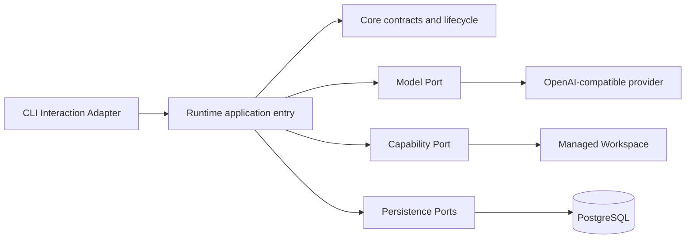

# ADR-0003: v0.1 Core Runtime CLI

- Status: Accepted
- Date: 2026-07-17
- Scope: Issue #9, version scope #2

## Context

The development-ready baseline proves the local toolchain and real integration prerequisites, but
it intentionally contains no product execution behavior. v0.1 must prove the six backend modules
through one real, inspectable CLI execution closure without pre-building later graph, agent, policy,
or user-interface features.

## Decision

v0.1 has six backend modules: `interaction`, `core`, `runtime`, `model`, `capability`, and
`persistence`.



- Interaction is CLI-only and maps external requests into Core and Runtime contracts. It does not
  call a provider or concrete Capability directly.
- Core owns identities, relationships, lifecycle vocabulary, structured errors, and persistence
  Protocols. It remains independent from SQLAlchemy, LangGraph, provider SDKs, transports, and
  concrete Capabilities.
- Runtime owns execution order and uses LangGraph for the fixed
  `START -> General Agent -> END` graph. It does not implement a second graph scheduler.
- Model is an independent Port. It is not part of the general Capability abstraction.
- Skill is a specialized Capability and uses the same Registry, invocation, validation, Runtime,
  persistence, and failure boundaries as file and process operations.
- Persistence implements Core persistence Ports. PostgreSQL is the authoritative business store.
- The managed Workspace is the local file, Skill, run-workspace, and Artifact boundary. Domain,
  model-visible, Event, Audit, Trace, and CLI surfaces use logical `anban://` references rather than
  physical host paths.

The accepted execution closure is:

```text
CLI Interaction
-> Task / ExecutionRun
-> fixed LangGraph General Agent
-> real Model Port
-> real Workspace Skill
-> governed real Capability
-> PostgreSQL state, Artifact, Event, Audit, and Trace
-> final CLI result and restart-safe inspection
```

Phase Gates must use real configured integrations and fail closed. Test protocol substitutes may
support deterministic unit tests but cannot serve as real acceptance evidence. Missing model,
Skill, Capability, database, audit, or trace conditions are failures; no provider, source, or Skill
receives a Core bypass or fallback-success path.

## v0.1 non-goals

v0.1 does not implement a React product UI, React Flow, TaskGraphSpec, the full GraphRevision
lifecycle, multiple Agents, parallel or branching graphs, subgraphs, browser, MCP, long-term
memory, Cron, Webhook, external asynchronous feedback, checkpoint resume, a complete Policy
Engine, approvals, a strong container sandbox, Replay, Risk Graph, Provenance Graph, model routing,
fallback, or Skill search and installation.

## Gate responsibilities

- P1 accepts the contracts, lifecycle, persistence Ports, migrations, repositories, boundaries, and
  deterministic reconstruction. Existing real integration checks prove environment readiness but
  do not claim the not-yet-built Runtime vertical slice.
- P2 accepts the real fixed Runtime path through ModelPort, Workspace Skill, CapabilityPort,
  PostgreSQL, Artifact, Event, Audit, and Trace.
- P3 accepts the public CLI, restart inspection, fail-closed security behavior, clean-checkout
  setup, documentation, exact-SHA CI, and scoped real end-to-end execution.

## Changes requiring a follow-up ADR

A new ADR is required before changing module ownership or dependency direction; separating Skill
from Capability; moving Model behind Capability; introducing another business database, queue, or
execution infrastructure; replacing the fixed graph with dynamic graph construction; adding a new
external integration boundary; changing Workspace or Artifact authority; or expanding the v0.1
security boundary into a general policy or sandbox system.

Ordinary implementation details that preserve these decisions do not require an ADR.

## Consequences

The initial product stays intentionally narrow. The CLI, Runtime, provider, Capability, Skill, and
storage adapters must compose through explicit Ports, and acceptance evidence must demonstrate the
real closure rather than infer it from code or isolated tests. Later versions can extend the system
only without bypassing these boundaries.
