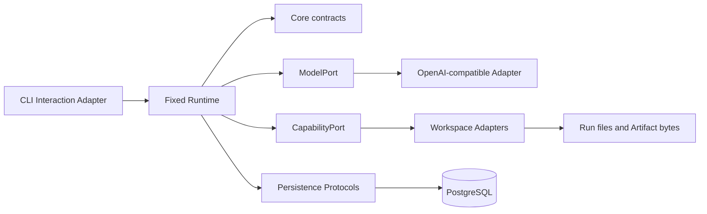

# Architecture Overview

v0.1 proves Anban's six backend modules through one CLI-only, restart-safe execution path. FastAPI
and React remain repository stack baselines; neither is a v0.1 product entry point.

## Module ownership

- **Interaction** adapts CLI input and output and is the only CLI-facing Runtime entry.
- **Core** owns typed identities, Task/Run/Node/Invocation/Artifact/Event contracts, lifecycle
  transitions, safe metadata, structured errors, and persistence Protocols.
- **Runtime** owns the fixed `START -> General Agent -> END` graph, bounded Tool Calling loop,
  execution discipline, persistence coordination, and restart-safe query projections.
- **Model** owns the independent ModelPort and OpenAI-compatible Adapter. It is not a Capability.
- **Capability** owns Registry, schema validation, Runtime-generated invocation context, governed
  file/process adapters, bounded multi-method HTTP requests, and Workspace Skill activation. A
  Skill is a specialized Capability. HTTP destinations are caller-selected without a host
  allowlist; ADR-0004 records the resulting SSRF tradeoff and fixed safety bounds.
- **Persistence** maps Core contracts to SQLAlchemy/PostgreSQL and implements short Unit of Work
  transactions and aggregate reconstruction.

Dependencies point inward toward Core contracts and Ports. Core never imports SQLAlchemy,
LangGraph, provider SDKs, CLI code, or concrete Capabilities. Interaction never calls the provider
or a concrete Capability. No provider, source, or Skill has a Core bypass.

## Runtime path and bounds

The only graph is `START -> General Agent -> END`. The General Agent may alternate model requests
and Capability observations inside its single node. One execution is limited to eight model turns,
eight Capability calls, and 180 seconds. Repeated calls and repeated observation fingerprints stop
no-progress execution. An invalid Tool Call fails before Capability execution. A successful HTTP
model request with an invalid response shape may use up to three Node-shared contract-repair
requests; each counts as a model turn and retains only safe structural diagnostics. Repair never
replays an already completed Capability signature.

Model transport retry and response repair are separate. The OpenAI-compatible SDK retries only
connection failures, timeouts, 408, 409, 429, and 5xx within the Agent deadline. Permanent HTTP
errors, configuration, Capability, persistence, and audit failures are not retried. Response repair
starts only after transport succeeded and before any Tool Call in that response was executed.

External model and process operations never run inside a database transaction. Runtime first
persists Task/Run/Node identity, then uses short transactions for lifecycle state and matching
Event facts. If state or Event persistence cannot establish a safe terminal result, the CLI cannot
report ordinary success. A completed side effect is not replayed after an ambiguous Event failure.

## Durable facts and projections

PostgreSQL stores the six business record types; Event rows form one ordered fact stream. `(run_id,
sequence)` determines Trace order. Audit is a security-relevant selection of the same allowlisted
Event projection; it is not a second fact table.

Artifact bytes remain in the external Workspace. PostgreSQL records only logical URI, SHA-256,
size, media type, and correlations. CLI, Event, Audit, Trace, and model-visible surfaces never need
the physical Workspace path.

Harness concerns—bounds, observability, safe failures, reproducibility, and acceptance—remain
cross-cutting and do not form a seventh module. See [ADR-0003](../adr/0003-v0.1-core-runtime-cli.md)
for frozen scope and follow-up ADR conditions.
